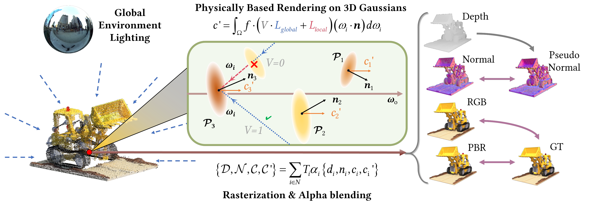

# Relightable 3D Gaussian
This is official implement of Relightable 3D Gaussian, which is described in the paper *Relightable 3D Gaussian: Real-time Point Cloud Relighting with BRDF Decomposition and Ray Tracing*.

We are cleaning up the code for public release. Coming soon!
